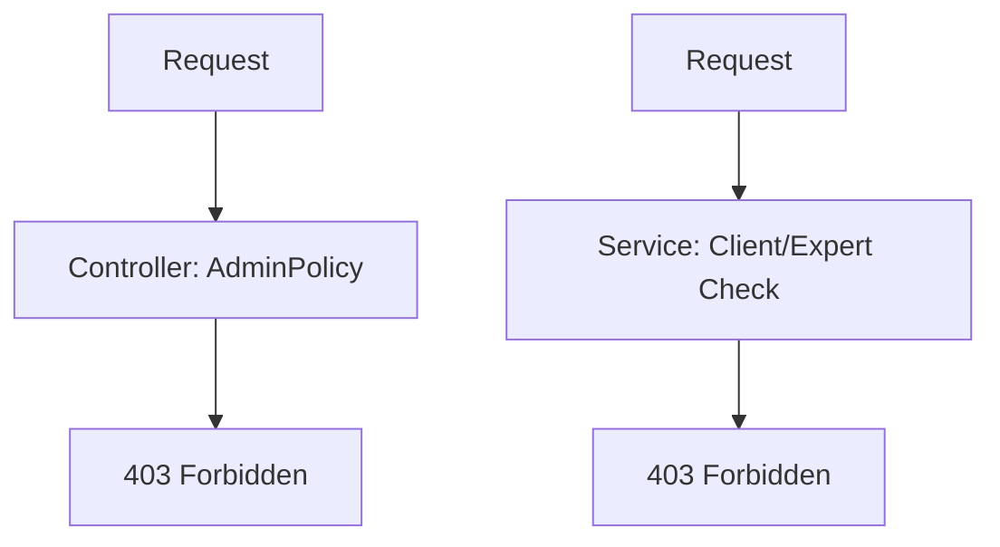

# Project Authorization Fix Design Spec
**Date:** 2026-06-29  
**Topic:** Fix HTTP 403 Forbidden Error in Project Detail API  
**Author:** Claude Code  
**Status:** Draft → Review → Approved → Implementation

---

## 📋 Tổng quan

### Vấn đề
Lỗi phân quyền nghiêm trọng tại endpoint `GET /api/v1/projects/{id}` gây đứt gãy luồng giao diện Workspace. Không có vai trò nào (Client/Expert/Admin) có thể lấy chi tiết dự án do conflict giữa Controller và Service layer.

### Tác động
- User experience: Workspace trống, không thể tiếp tục workflow
- Business flow: Job Creation → Apply → Accept → Fund → Submit → Approve bị block
- Error rate: 100% HTTP 403 khi truy cập project detail

### Mục tiêu
Sửa lỗi conflict authorization trong khi giữ nguyên business logic security model.

---

## 🏗️ Architecture Design

### Current Flow (Broken)


### Fixed Flow
```mermaid
graph TD
    A[Client/Expert/Admin Request] --> B[HTTP GET /api/v1/projects/{id}]
    B --> C[ProjectController.GetProject]
    C --> D[Authorize - chỉ cần authenticated]
    D --> E[ProjectService.GetProjectByIdAsync]
    E --> F[User Validation]
    F --> G{User Role?}
    G -->|ADMIN| H[Allow - xem mọi project]
    G -->|CLIENT/EXPERT| I{Check project ownership}
    I -->|Match| H
    I -->|Not Match| J[Throw 403]
    H --> K[Return Project Details]
```

---

## 🔧 Implementation Details

### 1. ProjectController.cs Modification

**File:** `Aivora.api/Controllers/ProjectController.cs`  
**Line:** 38

**Change:**
```csharp
// BEFORE
[HttpGet("{id}")]
[Authorize(Policy = JwtExtensions.AdminPolicy)]
public async Task<IActionResult> GetProject(Guid id)

// AFTER  
[HttpGet("{id}")]
[Authorize]  // ← Remove AdminPolicy, allow all authenticated users
public async Task<IActionResult> GetProject(Guid id)
{
    var userId = User.GetUserId();
    var userRole = User.GetUserRole();  // Extract from claims in Controller layer
    var result = await _projectService.GetProjectByIdAsync(userId, id, userRole);
    return Ok(result);
}
```

**Rationale:**
- Giảm coupling giữa Controller và Policy
- Để Service layer handle all authorization logic
- Maintain single source of truth for security rules

### 2. ProjectService/Service.cs Enhancement

**File:** `Aivora.Services/ProjectService/Service.cs`  
**Method:** `GetProjectByIdAsync`

**Enhanced logic (lines 29-33):**
```csharp
// BEFORE (line 30-31)
if (project.ClientId != userId && project.ExpertId != userId)
    throw new UnauthorizedException("Access denied to this project.");

// AFTER
// Null-safe ExpertId check - handles unassigned projects
// C# behavior: null != Guid always returns true (correct for our use case)
if (userRole != UserRole.ADMIN && 
    project.ClientId != userId && 
    project.ExpertId != userId)
    throw new UnauthorizedException("Access denied to this project.");
```

**Updated signature (pass-through parameter):**
```csharp
// Add UserRole parameter - extracted from claims in Controller
public async Task<Response.ProjectResponse> GetProjectByIdAsync(
    Guid userId, 
    Guid projectId, 
    UserRole userRole)
{
    var project = await _dbContext.Projects...
    
    if (userRole != UserRole.ADMIN && 
        project.ClientId != userId && 
        project.ExpertId != userId)
        throw new UnauthorizedException("Access denied to this project.");
    
    return MapToResponse(project);
}
```

---

## 🧪 Test Cases

### Unit Tests

```csharp
// Test 1: Admin access to any project
await service.GetProjectByIdAsync(adminUserId, anyProjectId, UserRole.ADMIN); // Should succeed

// Test 2: Client accessing their own project  
await service.GetProjectByIdAsync(clientUserId, clientProjectId, UserRole.CLIENT); // Should succeed

// Test 3: Expert accessing their own project
await service.GetProjectByIdAsync(expertUserId, expertProjectId, UserRole.EXPERT); // Should succeed

// Test 4a: Client accessing other's project (Expert exists)
await service.GetProjectByIdAsync(clientUserId, projectWithExpertId, UserRole.CLIENT); // Should throw 403

// Test 4b: Client accessing unassigned project (Expert null)
await service.GetProjectByIdAsync(clientUserId, projectWithoutExpertId, UserRole.CLIENT); // Should throw 403

// Test 5a: Expert accessing other's project (Client exists)
await service.GetProjectByIdAsync(expertUserId, projectWithClientId, UserRole.EXPERT); // Should throw 403

// Test 5b: Expert accessing unassigned project
await service.GetProjectByIdAsync(expertUserId, projectWithoutExpertId, UserRole.EXPERT); // Should throw 403
```

### Integration Tests

```csharp
// Test API endpoint with different roles
// Admin role
var adminRequest = new HttpRequestMessage(HttpMethod.Get, $"/api/v1/projects/{projectId}");
adminRequest.Headers.Authorization = new AuthenticationHeaderValue("Bearer", adminToken);
var adminResponse = await _client.SendAsync(adminRequest);
adminResponse.StatusCode.Should().Be(HttpStatusCode.OK);

// Client role (their project)
var clientRequest = new HttpRequestMessage(HttpMethod.Get, $"/api/v1/projects/{clientProjectId}");
clientRequest.Headers.Authorization = new AuthenticationHeaderValue("Bearer", clientToken);
var clientResponse = await _client.SendAsync(clientRequest);
clientResponse.StatusCode.Should().Be(HttpStatusCode.OK);

// Client role (other project)
var clientOtherRequest = new HttpRequestMessage(HttpMethod.Get, $"/api/v1/projects/{otherProjectId}");
clientOtherRequest.Headers.Authorization = new AuthenticationHeaderValue("Bearer", clientToken);
var clientOtherResponse = await _client.SendAsync(clientOtherRequest);
clientOtherResponse.StatusCode.Should().Be(HttpStatusCode.Forbidden);
```

---

## 🔄 Data Flow After Fix

### Success Responses
| Role | Condition | Response |
|------|-----------|----------|
| ADMIN | Any project | HTTP 200 with project details |
| CLIENT | Projects where they are Client | HTTP 200 with project details |
| EXPERT | Projects where they are Expert | HTTP 200 with project details |

### Error Responses
| Scenario | Status Code | Response |
|----------|-------------|----------|
| Anonymous user | 401 Unauthorized | Standard auth error |
| Authenticated but unauthorized | 403 Forbidden | "Access denied to this project" |
| Project not found | 404 Not Found | "Project not found" |

---

## 📊 Performance Impact

### Positive
- ✅ **No additional DB queries** - Role from JWT claims
- ✅ **Reduced policy coupling** - Simpler Controller
- ✅ **Faster authorization** - Single claim lookup vs policy evaluation

### Neutral  
- ⚪ **Same authorization logic** - Business rules preserved
- ⚪ **Same error handling** - Consistent response format

---

## 🔒 Security Considerations

1. **JWT Claims Validation**
   - Claims are validated by ASP.NET Core authentication pipeline
   - Role claims are trusted (validated at auth time)
   - No additional validation needed

2. **Null Safety**
   - ExpertId nullable comparison handled correctly by C#
   - No null reference exceptions possible
   - Clear business logic for unassigned projects

3. **Defense in Depth**
   - Controller layer: Basic authentication check
   - Service layer: Detailed business rule validation
   - Database layer: Row-level security (if implemented)

---

## 🚀 Rollout Plan

### Phase 1: Development
1. Implement Controller change
2. Add IHttpContextAccessor to Service
3. Update authorization logic
4. Write unit tests

### Phase 2: Testing  
1. Run all existing tests
2. Execute new test cases
3. End-to-end UI workflow test
4. Performance testing

### Phase 3: Deployment
1. Deploy to staging environment
2. Smoke test API endpoints
3. Monitor error logs
4. Deploy to production

---

## 📋 Design Checklist (✅ Completed)

- [x] Identify root cause (AdminPolicy vs Service conflict)
- [x] Design solution (remove policy, use claims)
- [x] Create architecture diagrams
- [x] Review security considerations
- [x] Define success criteria

## 📝 Implementation Checklist (⏳ Pending)

- [ ] Implement Controller change
- [ ] Implement Service enhancement
- [ ] Write comprehensive tests
- [ ] Update documentation
- [ ] Review with team
- [ ] Deploy to staging
- [ ] Monitor post-deployment

---

## 🔄 Backward Compatibility

✅ **API Contract** - No breaking changes to response format  
✅ **Authentication** - Same JWT token requirements  
✅ **Authorization Model** - Same role-based access rules  
✅ **Error Handling** - Same HTTP status codes and messages  

---

## 🎯 Success Criteria

1. **UI Fix** - Workspace displays project details after Accept Proposal
2. **API Flow** - `GET /api/v1/projects/{id}` works for all authorized roles
3. **Security** - No unauthorized access to project data
4. **Performance** - No additional DB queries
5. **Tests** - All new test cases pass