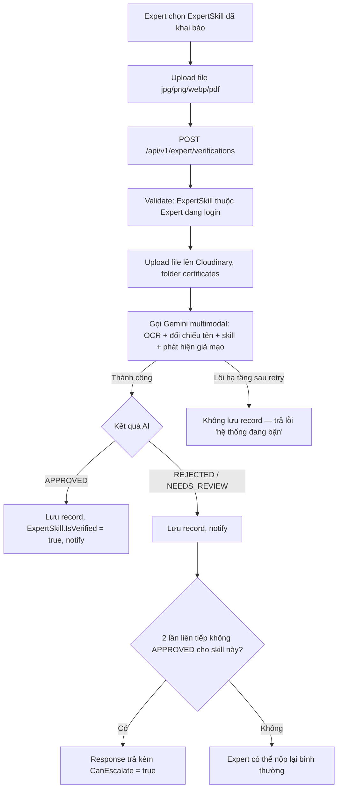

# Expert Skill/Certificate Verification Design Spec
**Date:** 2026-07-02
**Topic:** Xác thực skill/chứng chỉ của Expert bằng AI (Gemini multimodal)
**Author:** Claude Code (grilled with user)
**Status:** Draft → Review → Approved → Implementation

---

## 📋 Tổng quan

### Vấn đề
Sau khi đăng ký, Expert tự khai báo skill (`ExpertSkill`) mà không có cơ chế nào xác nhận skill/chứng chỉ đó là thật. Client không có tín hiệu tin cậy nào để phân biệt Expert có năng lực thật với Expert khai khống.

### Mục tiêu
Cho phép Expert nộp minh chứng (chứng chỉ/bằng cấp dạng file) cho từng skill đã khai báo. AI (Gemini multimodal, tái dùng model `gemini-2.5-flash` đã cấu hình) tự động phân tích và quyết định kết quả — không cần Admin duyệt tay ở luồng chính. Admin chỉ có vai trò giám sát (audit) và xử lý các ca tranh chấp qua cơ chế escalation.

### Ngoài phạm vi (Out of scope — lần này)
- Xác thực portfolio (link GitHub/demo) hoặc giấy tờ tuỳ thân (ID/KYC).
- Thay đổi thuật toán ranking/search để ưu tiên Expert verified (chỉ lưu flag + expose API).
- Xử lý bất đồng bộ / background job / queue.
- Admin override kết quả AI cho các ca **không** escalate (Admin không có nút "sửa" quyết định AI bình thường).
- 1 minh chứng áp dụng cho nhiều skill cùng lúc.
- Theo dõi ngày hết hạn chứng chỉ / yêu cầu tái xác thực định kỳ.

---

## 🏗️ Data Model

### Enum mới: `ExpertVerificationStatus`
(theo convention `SCREAMING_SNAKE_CASE` + `[JsonConverter(typeof(JsonStringEnumConverter))]` đã dùng cho `ProfileUpdateStatus`, `DisputeStatus`...)

```csharp
public enum ExpertVerificationStatus
{
    APPROVED,       // AI (hoặc Admin sau escalation) xác nhận hợp lệ
    REJECTED,       // AI (hoặc Admin sau escalation) xác nhận không hợp lệ
    NEEDS_REVIEW,   // AI xử lý được nhưng không đủ tin cậy để kết luận — Expert cần nộp lại minh chứng rõ hơn
    ESCALATED       // Expert yêu cầu Admin xem xét thủ công sau nhiều lần AI không approve
}
```

**Lưu ý quan trọng:** `NEEDS_REVIEW` chỉ dùng khi AI **thực sự chạy xong** và tự đánh giá không đủ tin cậy. Lỗi hạ tầng (Gemini rate limit/5xx/timeout/parse lỗi) **không** tạo bản ghi với trạng thái này — xem mục [Xử lý lỗi hạ tầng](#-xử-lý-lỗi-hạ-tầng-vs-ai-không-chắc-chắn).

### Entity mới: `ExpertVerification` (kế thừa `AuditableBaseEntity`)

```csharp
public class ExpertVerification : AuditableBaseEntity
{
    public Guid ExpertSkillId { get; set; }               // FK -> ExpertSkill, bắt buộc đã tồn tại trước
    public string EvidenceFileUrl { get; set; } = null!;   // Cloudinary secure_url
    public string EvidencePublicId { get; set; } = null!;  // Cloudinary public_id (để xoá khi cần)

    public ExpertVerificationStatus Status { get; set; }

    // Kết quả AI
    public decimal? AIConfidenceScore { get; set; }        // 0-100
    public string? AIReasoning { get; set; }                // Giải thích của AI, tiếng Anh (xem mục Ngôn ngữ)

    // Chỉ set khi Status từng là ESCALATED và đã được Admin xử lý
    public Guid? AdminId { get; set; }
    public string? AdminDecisionReason { get; set; }
    public DateTimeOffset? ReviewedAt { get; set; }

    public virtual ExpertSkill ExpertSkill { get; set; } = null!;
}
```

### Thay đổi trên `ExpertSkill`

```csharp
public bool IsVerified { get; set; } = false; // denormalized, sticky — chỉ chuyển false → true, không bao giờ reset lại
```

`IsVerified` được set `true` ngay khi có **bất kỳ** `ExpertVerification` nào của skill đó đạt `APPROVED` (dù qua AI trực tiếp hay qua Admin resolve escalation). Không có logic nào set lại `false`.

---

## 🔄 Luồng nghiệp vụ chính (Expert nộp minh chứng)



### Endpoint Expert-facing (`ExpertPolicy`)

| Method | Route | Mô tả |
|--------|-------|-------|
| `POST` | `/api/v1/expert/verifications` | Multipart: `ExpertSkillId` + file. Xử lý đồng bộ, trả kết quả AI ngay trong response. Rate limit: policy `AI` (20 req/phút). |
| `GET` | `/api/v1/expert/verifications?expertSkillId=` | Lịch sử nộp minh chứng của chính Expert đang login. Rate limit: `General`. |
| `POST` | `/api/v1/expert/verifications/{id}/escalate` | Chỉ cho phép khi `CanEscalate` đúng cho skill đó (2 lần liên tiếp không approved). Chuyển record mới nhất sang `ESCALATED`. Rate limit: `General`. |

### Endpoint Admin-facing (`AdminPolicy`)

| Method | Route | Mô tả |
|--------|-------|-------|
| `GET` | `/api/v1/admin/expert-verifications?status=&expertId=` | Xem toàn bộ (audit), **chỉ đọc**, không có action cho status khác `ESCALATED`. |
| `PUT` | `/api/v1/admin/expert-verifications/{id}/review` | Chỉ áp dụng khi `Status == ESCALATED`. Body: `{ IsApproved, RejectionReason }` — mirror `ReviewExpertProfileUpdateAsync`. Set `AdminId`, `AdminDecisionReason`, `ReviewedAt`, chuyển `Status` → `APPROVED`/`REJECTED`, và set `ExpertSkill.IsVerified = true` nếu approve. |

---

## 🤖 AI Provider (mở rộng pattern AI Job Assistant hiện có)

### Vấn đề kỹ thuật đã phát hiện
`GeminiProviderClient` (`Aivora.Services/AIJobAssistantService/Providers/GeminiProviderClient.cs`) hiện **chỉ hỗ trợ text** — `GenerateAsync(string prompt, CancellationToken ct)` build request chỉ với 1 `parts: [{ text }]`, không có `inline_data`/`mime_type`. Cần mở rộng.

### Thay đổi `GeminiProviderClient`
Thêm overload mới, **không đổi** signature cũ (3 provider Job Assistant hiện tại dùng nguyên, không ảnh hưởng):

```csharp
public async Task<string> GenerateAsync(
    string prompt,
    IReadOnlyList<(string MimeType, byte[] Data)> attachments,
    CancellationToken cancellationToken = default)
```
Build `parts` gồm 1 text part + N `inline_data` part (`mime_type`, `data` = base64) — dùng `inline_data` (embed trực tiếp bytes đã upload/đọc từ file, không dùng Gemini File API/`file_uri`, vì file chỉ vài MB, dưới giới hạn inline).

### Interface mới: `IAIExpertVerificationProvider`
```csharp
public interface IAIExpertVerificationProvider
{
    Task<AIVerificationResult> AnalyzeEvidenceAsync(
        AnalyzeEvidenceRequest request, CancellationToken cancellationToken = default);
}
```
`AnalyzeEvidenceRequest`: `byte[] FileBytes`, `string MimeType`, `string ExpertFullName`, `string ClaimedSkillName`.
`AIVerificationResult`: `ExpertVerificationStatus Outcome` (chỉ 1 trong 3: APPROVED/REJECTED/NEEDS_REVIEW — AI tự phân loại, không tính ESCALATED), `decimal ConfidenceScore`, `string Reasoning`.

- **`GeminiAIExpertVerificationProvider`**: gọi `GeminiProviderClient.GenerateAsync` với attachment, prompt yêu cầu Gemini tự output JSON `{ outcome, confidenceScore, reasoning }`.
- **`MockAIExpertVerificationProvider`**: dùng khi `AIProviderOptions.Provider != "Gemini"` (chế độ dev/test bình thường, theo đúng convention Mock fallback hiện có của toàn hệ thống) — trả kết quả canned cố định.
- **Khác biệt với 3 provider AI hiện có:** **không** áp dụng `EnableFallback` (Gemini lỗi giữa chừng → **không** tự động rơi về Mock để tránh Mock "bịa" ra APPROVED/REJECTED cho một file thật). Xem mục kế tiếp.

### Prompt design
`AIExpertVerificationPromptBuilder` yêu cầu Gemini:
1. OCR trích xuất: tên người được cấp, tên chứng chỉ/kỹ năng, tổ chức cấp, ngày cấp (nếu có). Hỗ trợ **đa ngôn ngữ** đầu vào (chứng chỉ tiếng Việt, Anh, hoặc khác).
2. Đối chiếu tên trích xuất với `ExpertFullName` được truyền vào.
3. Đối chiếu nội dung chứng chỉ với `ClaimedSkillName`.
4. Phát hiện dấu hiệu chỉnh sửa/giả mạo hiển nhiên (không xác minh qua bên thứ 3 — ngoài phạm vi).
5. Trả về đúng 1 trong 3 outcome + confidence score + `reasoning` — **output bằng tiếng Anh** (khớp ngôn ngữ hiện tại của nền tảng, chưa có i18n).

### DI Registration
Theo đúng factory pattern hiện có trong `ServiceCollectionExtensions.cs`:
```csharp
services.AddScoped<IAIExpertVerificationProvider>(sp =>
{
    var options = sp.GetRequiredService<IOptions<AIProviderOptions>>().Value;
    return string.Equals(options.Provider, "Gemini", StringComparison.OrdinalIgnoreCase)
           && !string.IsNullOrWhiteSpace(options.ApiKey)
        ? sp.GetRequiredService<GeminiAIExpertVerificationProvider>()
        : sp.GetRequiredService<MockAIExpertVerificationProvider>();
});
```

---

## ⚠️ Xử lý lỗi hạ tầng vs AI không chắc chắn

Đây là điểm quan trọng được nhấn mạnh khi grill — **không được gộp 2 loại lỗi này**, vì gộp sẽ khiến Expert hiểu nhầm lỗi hệ thống là lỗi ở chứng chỉ của họ.

| Loại lỗi | Ví dụ | Xử lý |
|----------|-------|-------|
| **Hạ tầng** | Gemini trả 429 (rate limit), lỗi 5xx, timeout mạng, parser không đọc được JSON response | Retry tự động 1-2 lần với backoff ngắn (trong cùng request đồng bộ). Nếu vẫn lỗi: **không lưu `ExpertVerification`**, trả lỗi nghiệp vụ (vd 503 "hệ thống đang bận, vui lòng thử lại") — **không tính là một lượt nộp**. |
| **AI không chắc chắn** | Ảnh mờ, thiếu thông tin, tên/skill không khớp rõ ràng | AI trả JSON hợp lệ với `outcome = NEEDS_REVIEW`. Lưu bình thường, tính vào lịch sử/đếm escalation. |

---

## 🆘 Cơ chế Escalation (van an toàn cho AI tự quyết)

Vì AI tự quyết hoàn toàn (không có Admin duyệt ở luồng chính), cần lối thoát cho trường hợp AI đánh giá sai lặp lại.

**Điều kiện kích hoạt:** 2 bản ghi **liên tiếp** (mới nhất) của cùng `ExpertSkillId` có `Status` thuộc `{REJECTED, NEEDS_REVIEW}` (không nhất thiết cùng loại, chỉ cần không phải `APPROVED`).

**Luồng:**
1. Response của lần nộp thứ 2 (không approved liên tiếp) trả thêm `CanEscalate: true`.
2. Expert gọi `POST /verifications/{id}/escalate` → record chuyển `Status = ESCALATED`.
3. Xuất hiện trong hàng đợi Admin (`GET /admin/expert-verifications?status=ESCALATED`).
4. Admin xử lý qua `PUT /admin/expert-verifications/{id}/review` — mirror `ReviewExpertProfileUpdateAsync` (set `AdminId`, `AdminDecisionReason`, `ReviewedAt`, chuyển `Status` → `APPROVED`/`REJECTED` cuối cùng).
5. Nếu Admin approve → `ExpertSkill.IsVerified = true` (sticky, như AI approve trực tiếp).

---

## 🔔 Notification

Dùng `NotificationService.SendNotificationAsync` hiện có, type mới `"VERIFICATION"`, wrap try/catch không chặn transaction chính (đúng pattern `AdminService`):

| Sự kiện | Trigger |
|---------|---------|
| AI trả `APPROVED` | Sau khi lưu record |
| AI trả `REJECTED` | Sau khi lưu record |
| AI trả `NEEDS_REVIEW` | Sau khi lưu record (để Expert biết cần nộp lại) |
| Admin resolve `ESCALATED` | Sau khi Admin duyệt/từ chối |

---

## 📁 File Upload

Tái dùng `MediaService` hiện có (Cloudinary), không viết lại:
- Thêm `"certificates"` vào `AllowedFolders` whitelist.
- Chỉ chấp nhận `.jpg/.jpeg/.png/.webp/.pdf` (validate ở tầng verification, dù `UploadFileAsync` gốc cho phép thêm `.zip/.rar/.docx/.txt` — các định dạng này không cần vì AI cần đọc trực quan).
- Giữ nguyên giới hạn size hiện có (ảnh 5MB, PDF qua nhánh `UploadFileAsync` 20MB).
- Tái dùng cơ chế validate magic-byte signature (`ValidateSignatureAsync`) đã có sẵn — chống giả mạo đuôi file.

---

## 🚦 Rate Limiting

- `POST /verifications` (gọi Gemini): policy `AI` (20 req/phút/user) — dùng chung, không tạo policy riêng.
- Các endpoint còn lại (list, escalate, admin review/audit): policy `General`.

---

## 📊 Bảng quyết định thiết kế (tổng hợp phiên grill)

| # | Quyết định |
|---|------------|
| 1 | Badge không chặn hoạt động; ảnh hưởng recommend/ranking để lại cho tính năng sau |
| 2 | Chỉ chứng chỉ/bằng cấp dạng file — không làm portfolio/ID verification |
| 3 | 1 minh chứng ↔ đúng 1 `ExpertSkill` |
| 4 | AI tự quyết hoàn toàn — không cần Admin duyệt ở luồng chính |
| 5 | 3 mức kết quả AI: APPROVED/REJECTED/NEEDS_REVIEW; nộp lại không giới hạn |
| 6 | Admin có trang audit read-only |
| 7 | Tái dùng `MediaService`, thêm folder `certificates`, giới hạn jpg/png/webp/pdf |
| 8 | Xử lý đồng bộ trong request (không background job) |
| 9 | Badge theo từng skill (không phải cấp Expert) |
| 10 | Verified có tính sticky — không bị hạ cấp bởi lần nộp sau |
| 11 | AI: OCR + đối chiếu tên chủ tài khoản + đối chiếu skill + phát hiện giả mạo cơ bản |
| 12 | Rate limit: dùng chung policy `AI` (20 req/phút) |
| 13 | Bắt buộc `ExpertSkill` tồn tại trước khi nộp minh chứng (không tự tạo) |
| 14 | Notification cho cả 3 trạng thái kết quả AI + khi Admin resolve escalation |
| 15 | Chỉ làm nền tảng dữ liệu + API; chưa đổi thuật toán ranking/search |
| 16 | Cho phép nộp thêm minh chứng ngay cả khi skill đã verified |
| 17 | OCR đa ngôn ngữ đầu vào; output `AIReasoning` bằng tiếng Anh (khớp ngôn ngữ nền tảng hiện tại) |
| 18 | Tách biệt lỗi hạ tầng (retry, không lưu record) khỏi AI không chắc chắn (lưu `NEEDS_REVIEW`) |
| 19 | Escalation: 2 lần liên tiếp không APPROVED → Expert có thể yêu cầu Admin xem xét thủ công |

---

## 🔓 Việc còn để mở cho giai đoạn implementation

- Ngưỡng confidence score cụ thể để AI tự phân loại outcome (số liệu tinh chỉnh, không phải quyết định kiến trúc).
- Tên chính xác migration/DbSet, cấu trúc DTO Request/Response chi tiết.
- Text nội dung prompt đầy đủ (`AIExpertVerificationPromptBuilder`).
- Test cases cụ thể (unit + integration) cho từng nhánh trạng thái ở trên.
