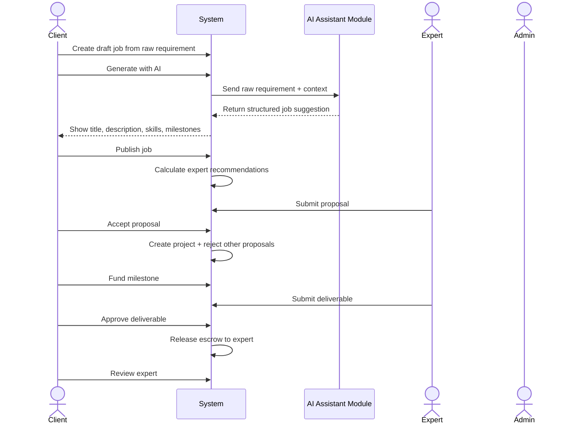
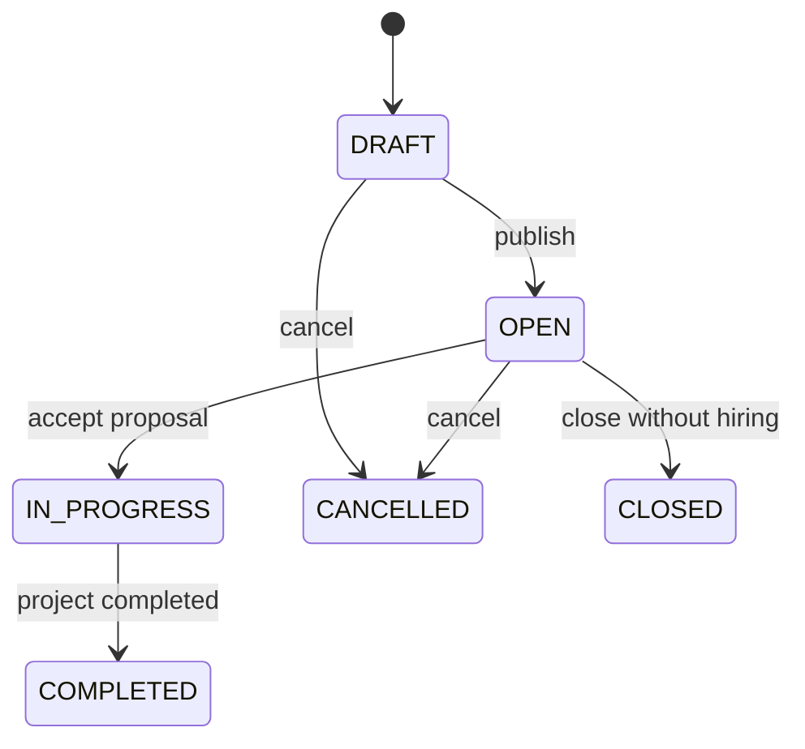
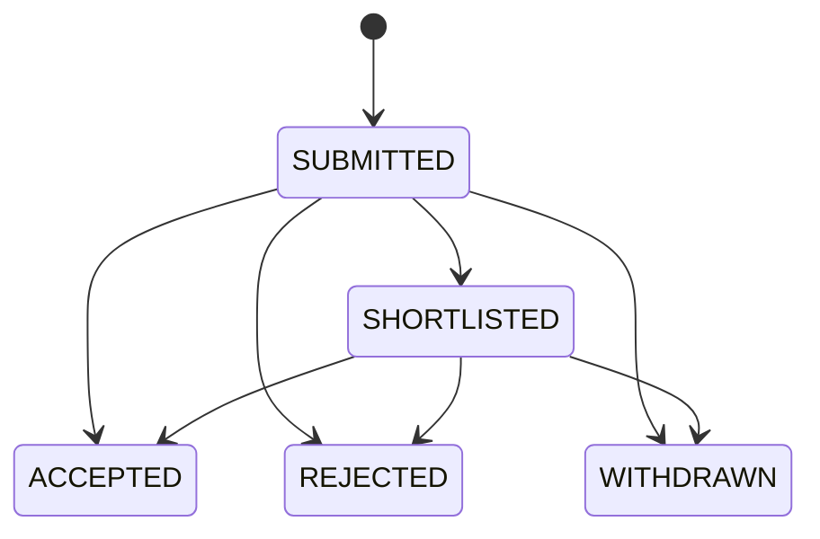
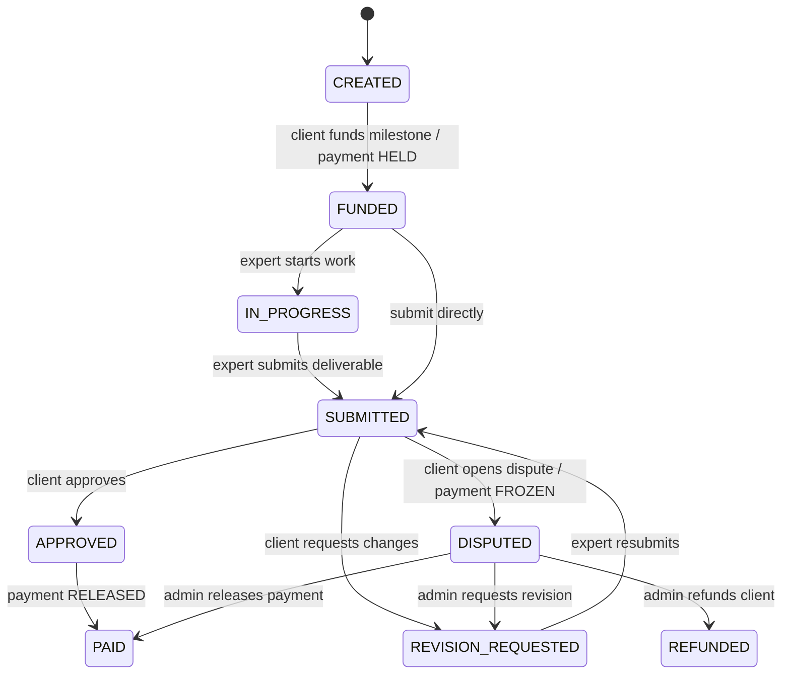

# AITasker Main Flow Specification

> Purpose: This file is written for an AI coding agent. Use it as the business-flow source of truth when generating backend APIs, frontend pages, database logic, tests, diagrams, and seed/demo scenarios.

---

## 0. Product Scope

AITasker is an AI-assisted marketplace for AI automation services. The system helps non-technical clients clarify project requirements, find suitable AI experts, manage delivery through milestones, and simulate escrow-style payment to reduce project risk.

### Core business chain

```text
Requirement
→ AI clarification
→ Job post
→ Expert recommendation
→ Proposal
→ Hiring
→ Project
→ Milestone
→ Simulated escrow
→ Deliverable
→ Approval / Revision / Dispute
→ Payment release / Refund
→ Review
```

### MVP focus

Build the marketplace flow deeply. Do not overbuild social features, real payment, real KYC, advanced analytics, or complex machine learning.

### Non-goals for MVP

- No real payment gateway.
- No real escrow legal handling.
- No blockchain or smart contract.
- No complex ML training.
- No real-time chat requirement; basic message CRUD is enough.
- No automatic dispute decision by AI.
- AI is a supporting module, not a separate actor in use-case analysis.

---

## 1. Actors

| Actor | Description | Main responsibility |
|---|---|---|
| Client | Business user or non-technical user who needs AI automation work | Creates job, reviews proposals, funds milestones, approves deliverables |
| Expert | AI professional or freelancer | Builds profile, receives recommendations/invites, submits proposals, delivers milestones |
| Admin | Platform operator | Manages users, jobs, payments, disputes, and platform safety |
| System | Backend platform logic | Calculates scores, updates states, creates projects, records transactions |
| AI Assistant Module | Internal AI feature used by the system | Improves job descriptions, suggests skills/milestones, optionally generates service descriptions |

Important: AI Assistant Module must not be modeled as a user actor. It is an internal system capability triggered by Client or Expert actions.

---

## 2. Core entities and database tables

Use these table names when mapping flow steps to persistence.

| Domain | Main tables |
|---|---|
| Identity | `Users`, `ClientProfiles`, `ExpertProfiles`, `Wallets` |
| Skills and categories | `Categories`, `Skills`, `ExpertSkills`, `JobSkills` |
| Job posting | `JobPosts`, `AIJobSuggestions` |
| Recommendation | `RecommendationResults` |
| Proposal | `Proposals`, `ProposalMilestones` |
| Project delivery | `Projects`, `Milestones`, `Deliverables` |
| Payment simulation | `Wallets`, `Payments`, `WalletTransactions` |
| Communication | `Conversations`, `Messages` |
| Review | `Reviews` |
| Dispute | `Disputes`, `DisputeEvidence` |

---

## 3. Status dictionary

### 3.1 User status

```text
Users.Status = ACTIVE | SUSPENDED | DELETED
Users.Role = CLIENT | EXPERT | ADMIN
```

### 3.2 Job status

```text
JobPosts.Status = DRAFT | OPEN | IN_PROGRESS | COMPLETED | CANCELLED | CLOSED
```

Recommended transitions:

```text
DRAFT → OPEN
OPEN → IN_PROGRESS
IN_PROGRESS → COMPLETED
DRAFT / OPEN → CANCELLED
OPEN → CLOSED
```

### 3.3 AI job suggestion status

```text
AIJobSuggestions.Status = GENERATED | ACCEPTED | REJECTED | FAILED
```

### 3.4 Proposal status

```text
Proposals.Status = SUBMITTED | SHORTLISTED | ACCEPTED | REJECTED | WITHDRAWN
```

Recommended transitions:

```text
SUBMITTED → SHORTLISTED
SUBMITTED / SHORTLISTED → ACCEPTED
SUBMITTED / SHORTLISTED → REJECTED
SUBMITTED / SHORTLISTED → WITHDRAWN
```

### 3.5 Project status

```text
Projects.Status = PENDING_PAYMENT | ACTIVE | IN_REVIEW | DISPUTED | COMPLETED | CANCELLED
```

Recommended transitions:

```text
PENDING_PAYMENT → ACTIVE
ACTIVE → IN_REVIEW
IN_REVIEW → ACTIVE
IN_REVIEW → DISPUTED
ACTIVE / IN_REVIEW → COMPLETED
ACTIVE / PENDING_PAYMENT → CANCELLED
DISPUTED → ACTIVE / COMPLETED / CANCELLED
```

### 3.6 Milestone status

```text
Milestones.Status = CREATED | FUNDED | IN_PROGRESS | SUBMITTED | REVISION_REQUESTED | APPROVED | DISPUTED | PAID | REFUNDED
```

Recommended transitions:

```text
CREATED → FUNDED
FUNDED → IN_PROGRESS
FUNDED / IN_PROGRESS / REVISION_REQUESTED → SUBMITTED
SUBMITTED → APPROVED
SUBMITTED → REVISION_REQUESTED
SUBMITTED → DISPUTED
APPROVED → PAID
DISPUTED → PAID / REFUNDED / REVISION_REQUESTED
```

### 3.7 Payment status

```text
Payments.Status = PENDING | HELD | RELEASED | REFUNDED | FROZEN | FAILED | PARTIALLY_RELEASED
```

Recommended transitions:

```text
PENDING → HELD
HELD → RELEASED
HELD → FROZEN
FROZEN → RELEASED / REFUNDED / PARTIALLY_RELEASED
HELD → REFUNDED
PENDING → FAILED
```

### 3.8 Deliverable status

```text
Deliverables.Status = SUBMITTED | APPROVED | REVISION_REQUESTED | REJECTED
```

### 3.9 Dispute status

```text
Disputes.Status = OPEN | UNDER_REVIEW | RESOLVED | CLOSED
Disputes.ResolutionType = RELEASE_TO_EXPERT | REFUND_TO_CLIENT | SPLIT_PAYMENT | REQUEST_REVISION
```

---

## 4. Main flow overview

This is the demo-grade happy path.

```text
1. Client registers/logs in.
2. Client creates a draft job from vague requirement.
3. Client runs AI Job Assistant.
4. AI returns improved title, description, skills, budget, timeline, milestones, questions, and risk warnings.
5. Client accepts/edits the AI suggestion and publishes the job.
6. System calculates expert recommendations.
7. Expert browses OPEN jobs and submits proposal.
8. Client reviews proposals and accepts one proposal.
9. System atomically creates project and rejects competing proposals.
10. Client funds the first milestone using simulated wallet/escrow.
11. Expert works and submits deliverable.
12. Client approves deliverable.
13. System releases escrow to expert wallet.
14. Project completes when all milestones are paid.
15. Client and Expert review each other.
```

---

## 5. Flow 1 — Authentication and profile setup

### Goal

Prepare users for role-based marketplace actions.

### Primary actors

Client, Expert, Admin.

### Preconditions

None.

### Happy path

```text
1. User registers with email, password, full name, and role.
2. System creates record in Users.
3. System creates Wallet for the user.
4. If role = CLIENT, system creates ClientProfiles.
5. If role = EXPERT, system creates ExpertProfiles.
6. User logs in.
7. System returns auth token and role.
8. Frontend redirects user to role-specific dashboard.
```

### Tables affected

- Write: `Users`, `Wallets`, `ClientProfiles` or `ExpertProfiles`
- Read: `Users`

### Critical validations

- Email must be unique.
- Role must be `CLIENT`, `EXPERT`, or `ADMIN`.
- Suspended/deleted users cannot log in.
- Expert-only actions require role `EXPERT`.
- Client-only actions require role `CLIENT`.
- Admin-only actions require role `ADMIN`.

### Suggested APIs

```text
POST /auth/register
POST /auth/login
GET /users/me
PUT /clients/me/profile
PUT /experts/me/profile
```

---

## 6. Flow 2 — AI-assisted job posting

### Goal

Help a non-technical client transform a vague need into a clear job post.

### Primary actor

Client.

### Supporting module

AI Assistant Module.

### Trigger

Client chooses `Create Job` and enters raw requirement.

### Preconditions

- Client is logged in.
- Client status is `ACTIVE`.

### Happy path

```text
1. Client opens Create Job page.
2. Client enters raw requirement.
   Example: "Tôi muốn chatbot AI cho shop bán mỹ phẩm."
3. Client enters optional context:
   - BusinessDomain
   - ExpectedOutcome
   - BudgetMin / BudgetMax
   - TimelineDays / Deadline
4. Client clicks "Generate with AI".
5. System sends raw requirement and context to AI Assistant Module.
6. AI Assistant returns structured suggestion:
   - SuggestedTitle
   - SuggestedDescription
   - SuggestedSkillsJson
   - SuggestedBudgetMin / SuggestedBudgetMax
   - SuggestedTimelineDays
   - SuggestedMilestonesJson
   - ClarifyingQuestionsJson
   - RiskWarningsJson
7. System stores suggestion in AIJobSuggestions with Status = GENERATED.
8. Client reviews the suggestion.
9. Client accepts the suggestion.
10. System creates or updates JobPosts:
    - OriginalDescription = raw client input
    - EnhancedDescription = accepted AI description
    - Title = accepted AI title or edited title
    - Status = DRAFT
11. System stores selected skills in JobSkills.
12. Client clicks Publish.
13. System updates JobPosts.Status = OPEN and PublishedAt = current UTC time.
```

### Alternative paths

#### A1 — Client rejects AI suggestion

```text
1. Client rejects suggestion.
2. System updates AIJobSuggestions.Status = REJECTED.
3. Client manually edits job.
4. Client may save as DRAFT or publish as OPEN.
```

#### A2 — AI fails

```text
1. AI call fails or returns invalid output.
2. System stores AIJobSuggestions.Status = FAILED if a log record exists.
3. System shows fallback message.
4. Client can still create job manually.
```

#### A3 — Save draft only

```text
1. Client saves job without publishing.
2. JobPosts.Status remains DRAFT.
3. Expert cannot see this job.
```

### Status transitions

```text
AIJobSuggestions: GENERATED → ACCEPTED / REJECTED / FAILED
JobPosts: DRAFT → OPEN
```

### Tables affected

- Write: `AIJobSuggestions`, `JobPosts`, `JobSkills`
- Read: `Users`, `ClientProfiles`, `Skills`, `Categories`

### Critical validations

- Only Client can create job.
- `OriginalDescription` is required.
- `BudgetMin <= BudgetMax` if both are provided.
- Published job must have title and description.
- AI output must be reviewed by user before publish.
- Never auto-publish AI-generated content without Client confirmation.

### Suggested APIs

```text
POST /ai/job-assistant
POST /jobs
PUT /jobs/{id}
POST /jobs/{id}/publish
GET /jobs/{id}
```

---

## 7. Flow 3 — Expert recommendation

### Goal

Rank experts for a published job and explain why each expert is recommended.

### Primary actor

System.

### Viewer

Client.

### Trigger

A job is published or Client opens recommended experts for a job.

### Preconditions

- JobPosts.Status = OPEN.
- There are active expert profiles.

### Happy path

```text
1. System loads published job.
2. System loads job skills, budget, category, description, and timeline.
3. System loads active experts.
4. System loads each expert's profile, skills, rating, completed projects, availability, and hourly rate.
5. System calculates matching score for each expert.
6. System stores result in RecommendationResults.
7. System returns ranked experts to Client.
8. Client sees match percentage and explanation.
```

### Recommended scoring model

```text
TotalScore =
  0.35 * SkillScore
+ 0.20 * PortfolioScore
+ 0.15 * RatingScore
+ 0.10 * BudgetScore
+ 0.10 * AvailabilityScore
+ 0.10 * CompletionScore
```

### Example recommendation output

```json
{
  "expertId": "...",
  "totalScore": 87.50,
  "explanation": "Matches 5/6 required skills, has RAG chatbot experience, rating 4.8/5, and budget fits the client's range."
}
```

### Alternative paths

#### A1 — No matching experts

```text
1. System returns empty list.
2. Frontend shows "No suitable experts found yet".
3. Client can still wait for proposals or edit job skills/budget.
```

#### A2 — Cold start expert with no reviews

```text
1. Expert has no review history.
2. System uses skill and profile matching more heavily.
3. RatingScore defaults to neutral, not zero.
```

### Tables affected

- Write: `RecommendationResults`
- Read: `JobPosts`, `JobSkills`, `ExpertProfiles`, `ExpertSkills`, `Skills`, `Reviews`, `Projects`

### Critical validations

- Recommendation must be explainable.
- Do not only filter by keyword.
- Do not label this as advanced AI if implementation is only weighted scoring.
- It is acceptable for MVP to implement weighted scoring first and embedding similarity later.

### Suggested APIs

```text
GET /jobs/{id}/recommendations
POST /jobs/{id}/recommendations/recalculate
```

---

## 8. Flow 4 — Expert submits proposal

### Goal

Allow an expert to apply for an open job with budget, timeline, and milestone plan.

### Primary actor

Expert.

### Trigger

Expert clicks `Submit Proposal` on an OPEN job.

### Preconditions

- Expert is logged in.
- Expert status is `ACTIVE`.
- Expert profile exists.
- JobPosts.Status = OPEN.
- Expert has not already submitted a proposal for this job.

### Happy path

```text
1. Expert browses OPEN jobs.
2. Expert filters/searches by category, skill, budget, or keyword.
3. Expert opens job detail.
4. Expert reviews:
   - EnhancedDescription
   - Required skills
   - Budget range
   - Timeline
   - Suggested milestones
5. Expert clicks Submit Proposal.
6. Expert enters:
   - CoverLetter
   - ProposedBudget
   - ProposedTimelineDays
   - ProposalMilestones
7. System validates input.
8. System creates Proposals with Status = SUBMITTED.
9. System creates ProposalMilestones if provided.
10. Client can now see proposal on job detail.
```

### Alternative paths

#### A1 — Duplicate proposal

```text
1. Expert already has proposal for this job.
2. System rejects request.
3. Return validation error: "You already submitted a proposal for this job."
```

#### A2 — Job is not open

```text
1. Expert attempts to submit proposal for DRAFT/IN_PROGRESS/CLOSED job.
2. System rejects request.
```

#### A3 — Expert withdraws proposal

```text
1. Expert opens proposal.
2. Expert clicks Withdraw.
3. System updates Proposals.Status = WITHDRAWN.
4. Withdrawn proposal cannot be accepted.
```

### Status transitions

```text
Proposals: none → SUBMITTED
Proposals: SUBMITTED / SHORTLISTED → WITHDRAWN
```

### Tables affected

- Write: `Proposals`, `ProposalMilestones`
- Read: `JobPosts`, `JobSkills`, `Users`, `ExpertProfiles`

### Critical validations

- One proposal per expert per job.
- ProposedBudget must be >= 0.
- Only experts can submit proposal.
- Expert cannot submit proposal to own job if system later supports users with multiple roles.

### Suggested APIs

```text
GET /jobs
GET /jobs/{id}
POST /jobs/{id}/proposals
GET /experts/me/proposals
PUT /proposals/{id}/withdraw
```

---

## 9. Flow 5 — Client reviews and accepts proposal

### Goal

Client compares proposals and hires one expert.

### Primary actor

Client.

### Trigger

Client opens proposal list for a job.

### Preconditions

- Client owns the job.
- JobPosts.Status = OPEN.
- At least one proposal has Status = SUBMITTED or SHORTLISTED.

### Happy path

```text
1. Client opens posted job.
2. System loads proposals for that job.
3. Client compares proposals by:
   - Expert rating
   - Proposed budget
   - Proposed timeline
   - Matching score
   - Portfolio relevance
   - Proposal content
4. Client opens proposal detail.
5. Client clicks Accept Proposal.
6. System starts database transaction.
7. System updates selected proposal Status = ACCEPTED.
8. System updates sibling proposals with Status SUBMITTED/SHORTLISTED to REJECTED.
9. System updates JobPosts.Status = IN_PROGRESS.
10. System creates Projects with Status = PENDING_PAYMENT.
11. System creates Milestones from ProposalMilestones if available.
12. If proposal has no milestone plan, system creates milestones from AI-suggested milestones or requires manual milestone creation.
13. System creates Conversation for Client and Expert if not already exists.
14. System commits transaction.
15. Client is redirected to project detail.
```

### Alternative paths

#### A1 — Shortlist proposal

```text
1. Client clicks Shortlist.
2. System updates Proposals.Status = SHORTLISTED.
3. Job remains OPEN.
```

#### A2 — Reject proposal

```text
1. Client clicks Reject.
2. System updates Proposals.Status = REJECTED.
3. Expert can no longer be accepted through that proposal.
```

#### A3 — Accept fails mid-process

```text
1. Any step inside transaction fails.
2. System rolls back all changes.
3. No project is created.
4. Proposal statuses remain unchanged.
```

### Status transitions

```text
Selected Proposal: SUBMITTED / SHORTLISTED → ACCEPTED
Sibling Proposals: SUBMITTED / SHORTLISTED → REJECTED
JobPosts: OPEN → IN_PROGRESS
Projects: none → PENDING_PAYMENT
Milestones: none → CREATED
```

### Tables affected

- Write: `Proposals`, `JobPosts`, `Projects`, `Milestones`, `Conversations`
- Read: `JobPosts`, `Proposals`, `ProposalMilestones`, `AIJobSuggestions`, `Users`

### Critical transaction rule

Accepting a proposal must be atomic. The system must not allow:

- Accepted proposal without project.
- Project without accepted proposal.
- Job still OPEN after accepted proposal.
- Competing proposal still SUBMITTED/SHORTLISTED after one proposal is accepted.

### Suggested APIs

```text
GET /jobs/{id}/proposals
GET /proposals/{id}
PUT /proposals/{id}/shortlist
PUT /proposals/{id}/reject
PUT /proposals/{id}/accept
GET /projects/{id}
```

---

## 10. Flow 6 — Project and milestone confirmation

### Goal

Confirm the delivery plan before payment is funded.

### Primary actors

Client, Expert.

### Trigger

Project is created after proposal acceptance.

### Preconditions

- Projects.Status = PENDING_PAYMENT.
- Milestones exist or can be created.

### Happy path

```text
1. Client opens project detail.
2. System shows project information and milestones.
3. Client and Expert review milestone plan.
4. Each milestone has:
   - Title
   - Description
   - Amount
   - DueDate
   - AcceptanceCriteria
   - OrderIndex
5. Client confirms milestone plan.
6. Project remains PENDING_PAYMENT until at least one milestone is funded.
```

### Alternative paths

#### A1 — Manual milestone creation

```text
1. Proposal did not include milestones.
2. Client creates milestones manually.
3. System stores Milestones with Status = CREATED.
```

#### A2 — Edit milestone before funding

```text
1. Client edits milestone amount/date/criteria before funding.
2. System updates milestone.
3. Funded/paid/disputed milestones cannot be freely edited.
```

### Status transitions

```text
Projects: PENDING_PAYMENT remains PENDING_PAYMENT
Milestones: CREATED remains CREATED
```

### Tables affected

- Write: `Milestones`, `Projects`
- Read: `Projects`, `Milestones`, `ProposalMilestones`

### Critical validations

- Milestone amount must be >= 0.
- Acceptance criteria should be present for meaningful review.
- Milestones should have deterministic order by `OrderIndex`.
- Only Client who owns the project can create/fund milestones.

### Suggested APIs

```text
GET /projects/{id}
POST /projects/{id}/milestones
PUT /milestones/{id}
DELETE /milestones/{id}
```

---

## 11. Flow 7 — Simulated escrow milestone funding

### Goal

Hold Client money for a milestone before Expert starts work.

### Primary actor

Client.

### Trigger

Client clicks `Fund Milestone`.

### Preconditions

- Client owns the project.
- Project status is `PENDING_PAYMENT` or `ACTIVE`.
- Milestone status is `CREATED`.
- Client wallet has enough `AvailableBalance`.

### Happy path

```text
1. Client opens project milestone.
2. Client clicks Fund Milestone.
3. System starts database transaction.
4. System checks Client Wallet.AvailableBalance >= Milestone.Amount.
5. System subtracts Milestone.Amount from Client Wallet.AvailableBalance.
6. System increases Client Wallet.HeldBalance by Milestone.Amount.
7. System creates Payments:
   - ProjectId
   - MilestoneId
   - PayerId = ClientId
   - PayeeId = ExpertId
   - Amount = Milestone.Amount
   - Status = HELD
   - HeldAt = current UTC time
8. System creates WalletTransactions:
   - Type = ESCROW_HOLD
   - Direction = DEBIT
   - UserId = ClientId
9. System updates Milestones.Status = FUNDED.
10. If Project.Status = PENDING_PAYMENT, update Projects.Status = ACTIVE.
11. System commits transaction.
12. Expert can begin work.
```

### Alternative paths

#### A1 — Insufficient balance

```text
1. Client wallet balance is not enough.
2. System rejects funding.
3. Client can use demo deposit flow to increase balance.
```

#### A2 — Milestone already funded

```text
1. Client attempts to fund same milestone twice.
2. System rejects request because each milestone has at most one payment.
```

### Status transitions

```text
Milestones: CREATED → FUNDED
Payments: none → HELD
Projects: PENDING_PAYMENT → ACTIVE
```

### Tables affected

- Write: `Wallets`, `Payments`, `WalletTransactions`, `Milestones`, `Projects`
- Read: `Wallets`, `Milestones`, `Projects`

### Critical transaction rule

Funding must be atomic. The system must not allow:

- Wallet debited without payment record.
- Payment HELD without wallet balance update.
- Milestone FUNDED without payment HELD.
- Duplicate payment for same milestone.

### Suggested APIs

```text
POST /wallet/deposit-demo
PUT /milestones/{id}/fund
GET /payments/history
```

---

## 12. Flow 8 — Expert submits deliverable

### Goal

Expert submits work result for a funded milestone.

### Primary actor

Expert.

### Trigger

Expert clicks `Submit Deliverable`.

### Preconditions

- Expert is assigned to project.
- Project.Status = ACTIVE.
- Milestone.Status = FUNDED, IN_PROGRESS, or REVISION_REQUESTED.
- Related payment status should be HELD.

### Happy path

```text
1. Expert opens active project.
2. Expert selects current milestone.
3. Expert clicks Submit Deliverable.
4. Expert enters:
   - Description
   - FileUrl or DemoUrl or SourceCodeUrl
   - Note
5. System creates Deliverables with Status = SUBMITTED.
6. System sets RevisionNumber:
   - 1 for first submission
   - previous max RevisionNumber + 1 for resubmission
7. System updates Milestones.Status = SUBMITTED.
8. System sets Milestones.SubmittedAt = current UTC time.
9. System updates Projects.Status = IN_REVIEW.
10. Client can review deliverable.
```

### Alternative paths

#### A1 — Resubmit after revision request

```text
1. Milestone.Status = REVISION_REQUESTED.
2. Expert submits new deliverable.
3. System creates new Deliverables record with incremented RevisionNumber.
4. Milestone.Status = SUBMITTED.
```

#### A2 — Invalid milestone state

```text
1. Milestone is CREATED, PAID, REFUNDED, or DISPUTED.
2. System rejects deliverable submission.
```

### Status transitions

```text
Milestones: FUNDED / IN_PROGRESS / REVISION_REQUESTED → SUBMITTED
Deliverables: none → SUBMITTED
Projects: ACTIVE → IN_REVIEW
```

### Tables affected

- Write: `Deliverables`, `Milestones`, `Projects`
- Read: `Projects`, `Milestones`, `Payments`

### Critical validations

- Only assigned Expert can submit deliverable.
- Deliverable must contain at least one useful result field: description, file URL, demo URL, source code URL, or note.
- Expert cannot submit deliverable if milestone has not been funded.

### Suggested APIs

```text
POST /milestones/{id}/deliverables
GET /milestones/{id}/deliverables
```

---

## 13. Flow 9 — Client reviews deliverable

### Goal

Client decides whether the milestone result meets acceptance criteria.

### Primary actor

Client.

### Trigger

Client opens a submitted deliverable.

### Preconditions

- Client owns project.
- Milestone.Status = SUBMITTED.
- Payment.Status = HELD.
- At least one deliverable exists for milestone.

### Happy path A — Approve deliverable

```text
1. Client opens milestone deliverable.
2. Client compares deliverable with AcceptanceCriteria.
3. Client clicks Approve.
4. System starts database transaction.
5. System updates latest Deliverables.Status = APPROVED.
6. System updates Milestones.Status = APPROVED.
7. System releases payment:
   - Payments.Status = RELEASED
   - ReleasedAt = current UTC time
8. System updates Client Wallet:
   - HeldBalance -= Amount
9. System updates Expert Wallet:
   - AvailableBalance += Amount
   - TotalEarned += Amount
10. System creates WalletTransactions for both sides:
    - Client: PAYMENT_RELEASE / DEBIT from held balance or audit entry
    - Expert: PAYMENT_RELEASE / CREDIT
11. System updates Milestones.Status = PAID.
12. System sets Milestones.ApprovedAt and PaidAt.
13. If all project milestones are PAID or REFUNDED, system updates Project.Status = COMPLETED.
14. Otherwise, system updates Project.Status = ACTIVE.
15. System commits transaction.
```

### Happy path B — Request revision

```text
1. Client opens milestone deliverable.
2. Client clicks Request Revision.
3. Client enters revision reason.
4. System updates latest Deliverables.Status = REVISION_REQUESTED.
5. System updates Milestones.Status = REVISION_REQUESTED.
6. Payment remains HELD.
7. Project.Status = ACTIVE.
8. Expert can submit another deliverable.
```

### Happy path C — Open dispute

```text
1. Client opens milestone deliverable.
2. Client clicks Open Dispute.
3. Client enters reason and description.
4. System starts database transaction.
5. System creates Disputes with Status = OPEN.
6. System updates Milestones.Status = DISPUTED.
7. System updates Payments.Status = FROZEN and FrozenAt = current UTC time.
8. System updates Projects.Status = DISPUTED.
9. System commits transaction.
10. Admin can review dispute.
```

### Status transitions

```text
Approve:
Deliverables: SUBMITTED → APPROVED
Milestones: SUBMITTED → APPROVED → PAID
Payments: HELD → RELEASED
Projects: IN_REVIEW → ACTIVE / COMPLETED

Request revision:
Deliverables: SUBMITTED → REVISION_REQUESTED
Milestones: SUBMITTED → REVISION_REQUESTED
Payments: HELD remains HELD
Projects: IN_REVIEW → ACTIVE

Open dispute:
Milestones: SUBMITTED → DISPUTED
Payments: HELD → FROZEN
Projects: IN_REVIEW → DISPUTED
Disputes: none → OPEN
```

### Tables affected

- Approve write: `Deliverables`, `Milestones`, `Payments`, `Wallets`, `WalletTransactions`, `Projects`
- Revision write: `Deliverables`, `Milestones`, `Projects`
- Dispute write: `Disputes`, `Milestones`, `Payments`, `Projects`
- Read: `Projects`, `Milestones`, `Deliverables`, `Payments`, `Wallets`

### Critical transaction rule

Approval/payment release must be atomic. The system must not allow:

- Payment released without expert wallet credited.
- Expert credited without payment released.
- Milestone paid while payment is still held/frozen.
- Project completed while unpaid milestones remain.

### Suggested APIs

```text
PUT /milestones/{id}/approve
PUT /milestones/{id}/request-revision
POST /milestones/{id}/dispute
```

---

## 14. Flow 10 — Admin dispute handling

### Goal

Allow Admin to resolve payment and milestone state when Client and Expert disagree.

### Primary actor

Admin.

### Trigger

Client or Expert opens a dispute.

### Preconditions

- Disputes.Status = OPEN or UNDER_REVIEW.
- Payments.Status = FROZEN.
- Milestones.Status = DISPUTED.
- Admin is logged in and active.

### Happy path

```text
1. Admin opens dispute list.
2. Admin selects a dispute.
3. System displays evidence:
   - Job description
   - Proposal
   - Project info
   - Milestone acceptance criteria
   - Deliverables
   - Messages
   - Payment status
   - Dispute reason
   - DisputeEvidence records
4. Admin updates Disputes.Status = UNDER_REVIEW if needed.
5. Admin chooses one resolution:
   A. RELEASE_TO_EXPERT
   B. REFUND_TO_CLIENT
   C. SPLIT_PAYMENT
   D. REQUEST_REVISION
6. System starts transaction.
7. System updates Disputes with ResolutionType, ResolutionNote, AdminId, ResolvedAt, Status = RESOLVED.
8. System updates Payment/Milestone/Wallet based on resolution.
9. System commits transaction.
10. Client and Expert can see dispute result.
```

### Resolution A — RELEASE_TO_EXPERT

```text
1. Payments.Status: FROZEN → RELEASED.
2. Expert Wallet.AvailableBalance += Amount.
3. Expert Wallet.TotalEarned += Amount.
4. Client Wallet.HeldBalance -= Amount.
5. Milestones.Status: DISPUTED → PAID.
```

### Resolution B — REFUND_TO_CLIENT

```text
1. Payments.Status: FROZEN → REFUNDED.
2. Client Wallet.HeldBalance -= Amount.
3. Client Wallet.AvailableBalance += Amount.
4. Milestones.Status: DISPUTED → REFUNDED.
```

### Resolution C — SPLIT_PAYMENT

```text
1. Payments.Status: FROZEN → PARTIALLY_RELEASED.
2. Client receives refund portion.
3. Expert receives release portion.
4. WalletTransactions records both movements.
5. Milestones.Status can become PAID or REFUNDED depending on product decision.
```

### Resolution D — REQUEST_REVISION

```text
1. Payments.Status remains HELD or changes from FROZEN back to HELD.
2. Milestones.Status: DISPUTED → REVISION_REQUESTED.
3. Projects.Status: DISPUTED → ACTIVE.
4. Expert can submit a new deliverable.
```

### Status transitions

```text
Disputes: OPEN → UNDER_REVIEW → RESOLVED
Payments: FROZEN → RELEASED / REFUNDED / PARTIALLY_RELEASED / HELD
Milestones: DISPUTED → PAID / REFUNDED / REVISION_REQUESTED
Projects: DISPUTED → ACTIVE / COMPLETED / CANCELLED
```

### Tables affected

- Write: `Disputes`, `DisputeEvidence`, `Payments`, `Wallets`, `WalletTransactions`, `Milestones`, `Projects`
- Read: `JobPosts`, `Proposals`, `Projects`, `Milestones`, `Deliverables`, `Messages`, `Payments`, `Wallets`

### Critical validations

- Only Admin can resolve dispute.
- Resolution must be auditable.
- Do not delete dispute evidence.
- FROZEN payment must not be released/refunded twice.
- Admin must provide ResolutionNote.

### Suggested APIs

```text
GET /admin/disputes
GET /admin/disputes/{id}
POST /admin/disputes/{id}/evidence
PUT /admin/disputes/{id}/resolve
```

---

## 15. Flow 11 — Review and rating

### Goal

Capture trust signals after project completion.

### Primary actors

Client, Expert.

### Trigger

Project becomes COMPLETED.

### Preconditions

- Projects.Status = COMPLETED.
- Reviewer participated in the project.
- Reviewer has not already reviewed the same reviewee for this project.

### Happy path

```text
1. Project is completed.
2. System allows Client to review Expert.
3. System allows Expert to review Client.
4. Reviewer enters:
   - Rating 1 to 5
   - Comment
   - Optional detailed ratings
5. System creates Reviews.
6. System updates ExpertProfiles.RatingAvg and CompletedProjects if needed.
7. Future recommendation uses review data.
```

### Status transitions

```text
Reviews: none → CREATED
Projects: COMPLETED remains COMPLETED
```

### Tables affected

- Write: `Reviews`, `ExpertProfiles`, optionally `ClientProfiles`
- Read: `Projects`, `Users`, `Reviews`

### Critical validations

- Rating must be 1 to 5.
- ReviewerId must not equal RevieweeId.
- One review per reviewer-reviewee-project pair.
- User cannot review a project they did not participate in.

### Suggested APIs

```text
POST /reviews
GET /users/{id}/reviews
```

---

## 16. Secondary flow — Messaging

### Goal

Allow Client and Expert to discuss job/project details.

### Scope

Basic message CRUD is enough for MVP. Real-time delivery is optional.

### Happy path

```text
1. Client or Expert opens conversation.
2. User sends message.
3. System creates Messages record.
4. Receiver opens conversation.
5. System marks message as read.
```

### Tables affected

- Write: `Conversations`, `Messages`
- Read: `Conversations`, `Messages`, `Projects`, `JobPosts`

### Suggested APIs

```text
GET /conversations
GET /conversations/{id}/messages
POST /conversations/{id}/messages
PUT /messages/{id}/read
```

---

## 17. Secondary flow — Expert service publishing

### Goal

Allow Expert to publish predefined AI service packages.

### MVP note

This is optional. Job → Proposal → Project is the main flow. Service marketplace should not block the core demo.

### Happy path

```text
1. Expert opens Create Service.
2. Expert enters service title, description, category, skills, price, and delivery time.
3. Expert may use AI Service Generator to improve text.
4. Expert edits and publishes service.
5. Client can browse service.
```

### Future tables if implemented

If current schema does not include services, add:

```text
Services
ServicePackages
ServiceSkills
ServiceOrders optional
```

---

## 18. Secondary flow — Admin management

### Goal

Allow Admin to manage platform safety and operations.

### Happy path

```text
1. Admin logs in.
2. Admin opens dashboard.
3. Admin views:
   - Total users
   - Total jobs
   - Active projects
   - Transactions
   - Open disputes
4. Admin manages users/jobs/services/projects/payments/disputes.
5. Admin can suspend users or hide invalid content.
```

### Suggested APIs

```text
GET /admin/dashboard
GET /admin/users
PUT /admin/users/{id}/suspend
GET /admin/jobs
PUT /admin/jobs/{id}/hide
GET /admin/payments
GET /admin/disputes
```

---

## 19. End-to-end demo script

Use this script for presentation and seed data.

```text
1. Login as Client: client@test.com.
2. Create job with raw input:
   "Tôi muốn chatbot AI cho shop bán mỹ phẩm."
3. Run AI Job Assistant.
4. Show generated title, description, skills, budget, and milestones.
5. Publish job.
6. Show recommended expert list with match score and explanation.
7. Login as Expert: expert@test.com.
8. Expert opens the job and submits proposal.
9. Expert includes 2 milestones:
   - Milestone 1: Requirement analysis and chatbot prototype
   - Milestone 2: Website integration and testing
10. Login as Client.
11. Client accepts proposal.
12. Show project automatically created.
13. Client funds first milestone.
14. Expert submits deliverable with demo URL or GitHub URL.
15. Client approves deliverable.
16. Show payment released to Expert wallet.
17. Repeat or mark remaining milestones as paid for demo.
18. Project becomes completed.
19. Client reviews Expert.
```

Optional dispute demo:

```text
1. Expert submits deliverable.
2. Client opens dispute instead of approving.
3. Payment becomes FROZEN.
4. Admin opens dispute detail.
5. Admin resolves with RELEASE_TO_EXPERT or REFUND_TO_CLIENT.
6. System updates wallet, payment, milestone, and dispute status.
```

---

## 20. API map by flow

| Flow | APIs |
|---|---|
| Auth | `POST /auth/register`, `POST /auth/login`, `GET /users/me` |
| Client profile | `PUT /clients/me/profile` |
| Expert profile | `PUT /experts/me/profile`, `POST /experts/me/skills` |
| AI job assistant | `POST /ai/job-assistant` |
| Job posting | `POST /jobs`, `PUT /jobs/{id}`, `POST /jobs/{id}/publish`, `GET /jobs`, `GET /jobs/{id}` |
| Recommendation | `GET /jobs/{id}/recommendations`, `POST /jobs/{id}/recommendations/recalculate` |
| Proposal | `POST /jobs/{id}/proposals`, `GET /jobs/{id}/proposals`, `GET /proposals/{id}` |
| Proposal decision | `PUT /proposals/{id}/shortlist`, `PUT /proposals/{id}/reject`, `PUT /proposals/{id}/withdraw`, `PUT /proposals/{id}/accept` |
| Project | `GET /projects`, `GET /projects/{id}` |
| Milestone | `POST /projects/{id}/milestones`, `PUT /milestones/{id}`, `PUT /milestones/{id}/fund` |
| Deliverable | `POST /milestones/{id}/deliverables`, `GET /milestones/{id}/deliverables` |
| Review deliverable | `PUT /milestones/{id}/approve`, `PUT /milestones/{id}/request-revision`, `POST /milestones/{id}/dispute` |
| Payment | `POST /wallet/deposit-demo`, `GET /payments/history` |
| Review | `POST /reviews`, `GET /users/{id}/reviews` |
| Messaging | `GET /conversations`, `GET /conversations/{id}/messages`, `POST /conversations/{id}/messages` |
| Admin | `GET /admin/users`, `PUT /admin/users/{id}/suspend`, `GET /admin/disputes`, `PUT /admin/disputes/{id}/resolve` |

---

## 21. Required backend service modules

Use these service boundaries when implementing backend.

```text
AuthService
UserService
ClientProfileService
ExpertProfileService
JobService
AIJobAssistantService
RecommendationService
ProposalService
ProjectService
MilestoneService
PaymentService
WalletService
DeliverableService
DisputeService
ReviewService
MessageService
AdminService
```

### Important orchestration rules

```text
ProposalService.AcceptProposalAsync
- Must run in one DB transaction.
- Updates selected proposal.
- Rejects sibling proposals.
- Updates job status.
- Creates project.
- Creates milestones.
- Creates conversation.

PaymentService.FundMilestoneAsync
- Must run in one DB transaction.
- Checks wallet balance.
- Moves available balance to held balance.
- Creates payment.
- Creates wallet transaction.
- Updates milestone and project status.

MilestoneService.ApproveDeliverableAsync
- Must run in one DB transaction.
- Approves deliverable.
- Releases payment.
- Moves held funds to expert wallet.
- Updates milestone/project status.

DisputeService.ResolveDisputeAsync
- Must run in one DB transaction.
- Updates dispute resolution.
- Updates payment.
- Updates wallets.
- Updates milestone/project status.
```

---

## 22. Database invariants

The AI coding agent must preserve these rules.

```text
1. Only one accepted proposal per job.
2. A job can have at most one project.
3. A project must reference the accepted proposal.
4. A milestone can have at most one payment.
5. A payment belongs to exactly one milestone.
6. A milestone cannot be funded twice.
7. A payment cannot be released/refunded twice.
8. Wallet balance must never become negative.
9. Client held balance represents escrow-held funds.
10. Expert receives money only after approval or admin release.
11. Disputed payment must be FROZEN until admin resolution.
12. Project can become COMPLETED only when all milestones are PAID or terminally resolved.
13. AI suggestions are never automatically published without human confirmation.
14. Recommendation results must include score explanation.
15. Review cannot be self-review.
```

---

## 23. Frontend pages by flow

| Page | Route example | Purpose |
|---|---|---|
| Login | `/login` | Authenticate users |
| Register | `/register` | Create account |
| Client dashboard | `/client/dashboard` | Show jobs/projects/payments |
| Create job | `/client/jobs/create` | Raw requirement + AI assistant |
| Job detail | `/jobs/{id}` | Public job detail |
| Recommended experts | `/client/jobs/{id}/recommendations` | Show expert ranking |
| Proposal list | `/client/jobs/{id}/proposals` | Compare proposals |
| Submit proposal | `/expert/jobs/{id}/proposal` | Expert applies to job |
| Project detail | `/projects/{id}` | Milestones, payment, deliverables |
| Milestone detail | `/milestones/{id}` | Fund, submit, approve, dispute |
| Conversation | `/conversations/{id}` | Messages |
| Admin dashboard | `/admin/dashboard` | Platform overview |
| Admin disputes | `/admin/disputes` | Dispute handling |
| Reviews | `/projects/{id}/reviews` | Post-completion rating |

---

## 24. Mermaid diagrams

### 24.1 Core sequence



### 24.2 Job state



### 24.3 Proposal state



### 24.4 Milestone/payment state



---

## 25. Testing checklist

### Must-have integration tests

```text
1. Client can create AI-assisted job draft.
2. Client can publish job.
3. Published job triggers or supports recommendation calculation.
4. Expert can submit one proposal to OPEN job.
5. Expert cannot submit duplicate proposal to same job.
6. Client can shortlist proposal.
7. Client can reject proposal.
8. Client can accept proposal.
9. Accepting proposal creates project.
10. Accepting proposal rejects sibling proposals.
11. Accepting proposal changes job to IN_PROGRESS.
12. Client can fund milestone if wallet balance is enough.
13. Client cannot fund milestone if wallet balance is insufficient.
14. Funding milestone creates HELD payment.
15. Expert can submit deliverable for funded milestone.
16. Client can request revision.
17. Expert can resubmit after revision.
18. Client can approve deliverable.
19. Approval releases payment to expert wallet.
20. Client can open dispute.
21. Opening dispute freezes payment.
22. Admin can resolve dispute by release.
23. Admin can resolve dispute by refund.
24. Review can be created after project completion.
25. User cannot review self.
```

### Transaction tests

```text
1. Accept proposal rollback leaves no partial project.
2. Fund milestone rollback leaves wallet unchanged.
3. Approve deliverable rollback does not release money twice.
4. Resolve dispute rollback does not corrupt wallet/payment status.
```

---

## 26. AI coding agent instructions

When implementing from this file:

```text
1. Prioritize the end-to-end flow over secondary features.
2. Implement status transitions explicitly; do not allow random status updates.
3. Keep payment as simulated escrow only.
4. Use transactions for proposal acceptance, milestone funding, deliverable approval, and dispute resolution.
5. Add service-level validation before database writes.
6. Add authorization checks by role and ownership.
7. Preserve auditability with WalletTransactions and DisputeEvidence.
8. Keep AI outputs user-editable and never auto-publish them.
9. Recommendation must return explanation, not just score.
10. Use simple message CRUD before real-time chat.
11. Use seed accounts for demo:
    - client@test.com
    - expert@test.com
    - admin@test.com
12. Use the demo scenario in section 19 as the acceptance test for MVP.
```

---

## 27. Final one-line flow

```text
Client vague need → AI-assisted job post → expert recommendation → proposal → accept/hire → project + milestones → simulated escrow → deliverable → approve/revision/dispute → payment resolution → review
```
